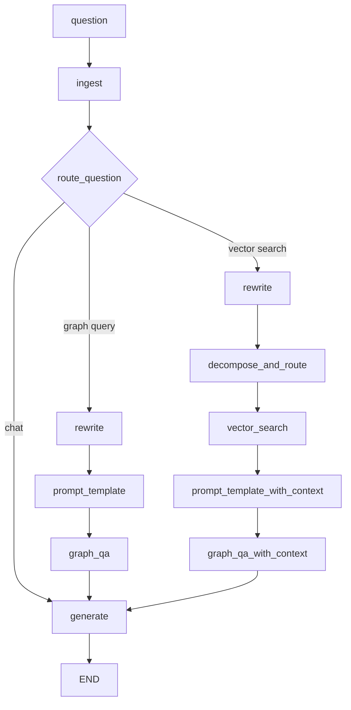

# Plan — Conversación con memoria de sesión sobre hallazgos GraphRAG

Al confirmar este plan, el único cambio en el repo será crear `[Pipeline_RAG/PLAN_conversacion_memoria.md](Pipeline_RAG/PLAN_conversacion_memoria.md)` (mismo estilo que `[Pipeline_RAG/PLAN_respuesta_llm_sintesis.md](Pipeline_RAG/PLAN_respuesta_llm_sintesis.md)`: propuesta, no implementada). El código se implementa después, cuando lo pidas.

**Alcance de esta fase:** memoria de sesión + ruta `chat` (hablar de hallazgos sin Neo4j) + reescritura de follow-ups que sí piden datos nuevos + loop en `[Pipeline_RAG/00_run_script.ipynb](Pipeline_RAG/00_run_script.ipynb)`. Sin UI Streamlit/Gradio.

---

## 0. Diagnóstico: por qué hoy no hay conversación

Cada `app.invoke({"question": "..."})` es un turno aislado.

- `[Graph/state.py](Pipeline_RAG/Graph/state.py)` no tiene `messages` ni historial. Campos actuales: `question`, `documents`, `context_refs`, `prompt`, `prompt_with_context`, `subqueries`, `target_labels`, `answer`.
- `[Graph/graph.py](Pipeline_RAG/Graph/graph.py)` compila sin checkpointer: `app = workflow.compile()`. LangGraph no guarda estado entre invocaciones.
- `[Graph/nodes.py](Pipeline_RAG/Graph/nodes.py)` `generate` solo pasa `question` + `documents` a `[Chains/generate_answer.py](Pipeline_RAG/Chains/generate_answer.py)`.
- `[Prompts/answer_promt.py](Pipeline_RAG/Prompts/answer_promt.py)` es un único turno `system` + `human`.
- `[Chains/router.py](Pipeline_RAG/Chains/router.py)` solo conoce `"vector search"` | `"graph query"`. Un “explícame el primero” se trata como pregunta nueva y vuelve a Neo4j.

`langgraph>=1.0` ya está en `[requirements.txt](requirements.txt)`. No hace falta paquete nuevo. `MemorySaver` / `add_messages` no se usan en ningún archivo hoy.

---

## 1. Diseño objetivo

Dos tipos de turno:

- **Chat (sin Neo4j):** “explícame el primero”, “compara 2 y 3”, “resúmelo en tabla”. Usa `documents` del checkpoint + historial.
- **Nueva consulta:** “ahora los de Meta”, “¿cuántos downloads tiene el primero?”. Reescribir a pregunta autocontenida y sí pasar por vector/Cypher.




Memoria: `MemorySaver` + `thread_id`. En invocaciones siguientes, las claves que no vienen en el input (sobre todo `documents`) **persisten** del checkpoint. Por eso la ruta `chat` puede ir directo a `generate` sin copiar `last_documents`, siempre que `generate` no pise `documents`.

---

## 2. Qué no se toca

- `Pipeline_embeddings/`, índices Neo4j, `return_direct=True` en `[graph_qa_chain.py](Pipeline_RAG/Chains/graph_qa_chain.py)`
- `[Tools/tools.py](Pipeline_RAG/Tools/tools.py)` (código muerto)
- `[Prompts/prompt_examples.py](Pipeline_RAG/Prompts/prompt_examples.py)`
- Nombre del archivo `answer_promt.py` (typo histórico; no renombrar)
- No poner `temperature` en Azure (`gpt-5-mini`)
- No UI Streamlit/Gradio
- No arreglar de paso el bug de `decompose_and_route` (si el `except` corre, la línea siguiente usa `result.labels` y `result` no existe). Fuera de alcance.

---

## 3. Implementación paso a paso (para cuando se retome el código)

### Paso A — Constantes de nodos

Archivo: `[Graph/labels.py](Pipeline_RAG/Graph/labels.py)`

Añadir:

- `INGEST = "ingest"`
- `REWRITE = "rewrite"`

`GENERATE` ya existe. No hace falta un nodo `CHAT`: esa ruta apunta al mismo `generate`.

### Paso B — Estado con historial

Archivo: `[Graph/state.py](Pipeline_RAG/Graph/state.py)`

Añadir:

- `messages: Annotated[list, add_messages]` — historial de `HumanMessage` / `AIMessage`. El reducer **acumula**, no reemplaza.
- `standalone_question: str` — pregunta reescrita, autocontenida, para Cypher/vector. En el primer turno = `question`.

Importar `Annotated` y `add_messages` (`langgraph.graph.message`). Actualizar el comentario-tabla del propio archivo.

No añadir `last_documents` si se usa checkpointer: `documents` sobrevive entre turnos.

### Paso C — Helper de recorte (archivo nuevo)

Nuevo: `Pipeline_RAG/Tools/session_memory.py`

Funciones pequeñas, sin LLM:

- `recent_messages(messages, n=8)` — últimos N mensajes.
- `messages_as_text(messages)` — serializa rol+contenido para prompts que no usan `MessagesPlaceholder` (router y rewrite).
- `documents_digest(documents, max_chars=3000)` — JSON compacto (ids, nombres, conteos). El rewrite necesita “el primero” → `model_id` concreto. No mandar tags/listas enormes.

El prompt de `generate` sigue recibiendo `documents` completo (como hoy). El digest es solo para router/rewrite.

### Paso D — Nodo `ingest`

Archivo: `[Graph/nodes.py](Pipeline_RAG/Graph/nodes.py)`

```python
def ingest(state: GraphState):
    return {"messages": [HumanMessage(content=state["question"])]}
```

Punto de entrada único. Así el router del turno 2 ya ve el historial del turno 1 **y** el human actual.

### Paso E — Router con tercera ruta `chat`

Archivo: `[Chains/router.py](Pipeline_RAG/Chains/router.py)`

1. Ampliar `RouteQuery.datasource` a `Literal["vector search", "graph query", "chat"]`.
2. El prompt humano deja de ser solo `{question}`. Pasar `{question}`, `{chat_history}`, `{documents_digest}`.
3. Reglas nuevas en el system prompt:
  - `chat` si hay hallazgos previos y el usuario aclara, compara, resume, traduce o reformatea **sin pedir entidades/agregaciones/filtros nuevos**.
  - Si pide un hecho que **no** está en el digest (likes, downloads, otro autor, otra entidad) → `graph query` o `vector search` como hasta ahora.
  - Historial vacío o digest vacío → **nunca** `chat`.
  - Pronombres (“eso”, “el primero”, “esos modelos”) no implican `chat` por sí solos: si piden un campo nuevo, es retrieval.

Ejemplos a meter en el prompt:

- Tras una lista de 5 modelos, “explícame el primero” → `chat`
- “compara el 2 y el 3” → `chat`
- “¿cuántos downloads tiene el primero?” → `graph query`
- “ahora modelos de meta” → `graph query` o `vector search` según semántica

`route_question` en `[graph.py](Pipeline_RAG/Graph/graph.py)` debe invocar el router con historial recortado + digest, no solo `state["question"]`. Mapear `"chat"` → `GENERATE`.

### Paso F — Cadena y nodo `rewrite` (archivo nuevo)

Nuevo: `Pipeline_RAG/Chains/rewrite.py`

Modelo: el mismo `AzureChatOpenAI` que el decomposer (`AZURE_DECOMPOSER_DEPLOYMENT`), salida string (o Pydantic de un campo).

Tarea: historial + digest + follow-up → **una pregunta autocontenida** en el mismo idioma.

- “¿cuántos likes tiene el primero?” + digest con 5 `model_id` → “How many likes does models/google/bert_uncased_L-12_H-768_A-12 have?”
- Si la pregunta ya es autocontenida, devolverla igual.
- No inventar ids que no estén en el digest. Si no se puede resolver “el primero”, devolver la pregunta original.

Nodo en `nodes.py`:

- Si `messages` tiene ≤1 human (primer turno) → `standalone_question = question` sin llamar al LLM.
- Si no → `rewrite_chain.invoke(...)`.
- Devolver `{"standalone_question": ..., "question": question}`.

Los nodos de retrieval deben preferir `standalone_question`:

- `decompose_and_route`: `retriever_decompose_router.invoke({"question": state.get("standalone_question") or state["question"]})`
- `graph_qa`: `query` = standalone
- `vector_search` / `graph_qa_with_context`: las subqueries ya salen del decomposer sobre la pregunta reescrita

`question` original se conserva para `generate` (el usuario ve su wording, no el rewrite).

### Paso G — Prompt y cadena de respuesta con historial

`[Prompts/answer_promt.py](Pipeline_RAG/Prompts/answer_promt.py)`:

```python
answer_prompt = ChatPromptTemplate.from_messages([
    ("system", system),
    MessagesPlaceholder("messages", optional=True),
    ("human", Human_prompt),
])
```

El `MessagesPlaceholder` debe ser **historial previo**, no el turno actual (el human template ya tiene `{question}`). En `generate` pasar `messages` **sin** el último HumanMessage que acaba de añadir `ingest`, o recortar el último si el contenido coincide con `question`. Si no, el modelo ve la pregunta dos veces.

Añadir al system, sin relajar grounding:

- Hay historial de esta sesión; úsalo para resolver referencias (“el primero”, “esos”).
- Los hechos canónicos siguen siendo `documents` del último retrieval. El historial no autoriza a inventar nodos, conteos ni propiedades de Hugging Face.
- En un turno `chat`, si `documents` no cubre lo pedido, decirlo y no alucinar. No hace falta reconsultar el grafo desde este nodo.

`[Chains/generate_answer.py](Pipeline_RAG/Chains/generate_answer.py)`: `invoke` también con `"messages": inputs.get("messages") or []`.

Nodo `generate`:

```python
answer = generate_answer({
    "question": state["question"],
    "documents": _to_text(state.get("documents")),
    "messages": prior_only,
})
return {"answer": answer, "messages": [AIMessage(content=answer)]}
```

`add_messages` concatena el `AIMessage`. No devolver `documents` aquí (se conservan).

### Paso H — Recablear el grafo

Archivo: `[Graph/graph.py](Pipeline_RAG/Graph/graph.py)`

1. Importar `INGEST`, `REWRITE`, `ingest`, `rewrite`, `MemorySaver`.
2. Sustituir `set_conditional_entry_point` por:
  - `workflow.add_node(INGEST, ingest)`
  - `workflow.set_entry_point(INGEST)`
  - `workflow.add_conditional_edges(INGEST, route_question, {chat: GENERATE, graph: REWRITE, vector: REWRITE})`
3. Dos usos del mismo nodo `REWRITE` (LangGraph permite un nodo con varios outgoing). Edges:
  - Tras rewrite, **otro** condicional según la decisión ya tomada, **o** guardar `datasource` en el estado en `route_question` y ramificar después de rewrite.

Patrón limpio: `route_question` además de retornar el string de ruteo, no puede escribir estado (es condicional). Solución: el condicional `route_question` escribe vía un nodo intermedio **o** se añade `route: str` con un nodo `route_and_store` entre ingest y el branch.

Recomendación concreta (un LLM call, no dos):

1. Nodo `ingest`.
2. Nodo `route_and_store`: llama a `question_router`, guarda `{"route": source.datasource}` en el estado, retorna el dict.
3. `add_conditional_edges(ROUTE_AND_STORE, lambda s: s["route"], ...)`.

Añadir `route: str` a `GraphState`.

Edges retrieval:

- `REWRITE` → si `route == "graph query"` → `PROMPT_TEMPLATE` → `GRAPH_QA` → `GENERATE`
- `REWRITE` → si `route == "vector search"` → `DECOMPOSE_AND_ROUTE` → … → `GENERATE`
- `chat` → `GENERATE` (sin rewrite)

Compilar:

```python
app = workflow.compile(checkpointer=MemorySaver())
```

`MemorySaver` es in-process: reiniciar el kernel del notebook borra la sesión. Documentarlo en el plan y en el notebook. Para el TG es suficiente; no usar SQLite/Postgres checkpointer en esta fase.

### Paso I — Notebook: loop de sesión

Archivo: `[Pipeline_RAG/00_run_script.ipynb](Pipeline_RAG/00_run_script.ipynb)`

Añadir celdas (sin borrar las de invocación suelta, o marcarlas como “turno único / sin memoria”):

```python
SESSION_ID = "tg-demo"
config = {"configurable": {"thread_id": SESSION_ID}}

def chat(text: str):
    out = app.invoke({"question": text}, config=config)
    display(Markdown(out["answer"]))
    return out
```

Script de prueba mínimo a dejar escrito en el markdown y, al implementar, en el notebook:

1. `chat("find top 5 models related to text classification")` — debe ir a vector search.
2. `chat("explícame el primero y en qué se diferencia del segundo")` — logs: ruta `chat`, **sin** Cypher/vector.
3. `chat("¿cuántos downloads tiene el primero?")` — ruta graph query; rewrite debe insertar el `model_id` del paso 1.
4. Nuevo `thread_id` y “explícame el primero” — **no** `chat` (historial vacío).

Para ver el ruteo: prints existentes (`---ROUTE QUESTION TO ...---`) más uno nuevo `---REWRITE--- {standalone_question}`.

### Paso J — Verificación (no hay test suite)

Validar a mano contra Neo4j + Azure, en este orden:

1. Turno 1 idéntico al comportamiento actual (misma rama, `answer` grounded en `documents`).
2. Turno 2 chat: no aparece `Entering new GraphCypherQAChain` ni `vector.queryNodes`.
3. Turno 3 rewrite+graph: el Cypher generado contiene un id real del turno 1, no el literal “el primero”.
4. `documents` en un turno chat sigue siendo el del último retrieval (`graph_qa_result["documents"]` no vacío).
5. Otro `thread_id` no filtra memoria de la sesión anterior.
6. Pregunta en español → respuesta en español (regla ya existente).

---

## 4. Orden de implementación recomendado (cuando se codee)

1. `session_memory.py` + campos de estado + `ingest` + checkpointer (aún sin ruta chat: el historial ya se guarda).
2. Prompt/cadena `generate` con `MessagesPlaceholder` + nodo que escribe `AIMessage`.
3. Router `chat` + recableado (ya se puede conversar sobre hallazgos).
4. `rewrite.py` + `standalone_question` en nodos de retrieval.
5. Helper `chat()` y celdas de prueba en el notebook.
6. Pasar el script de verificación de la sección 3.J.

Pasos 1–3 ya cumplen “hablar de la respuesta con memoria”. El 4 conecta follow-ups al grafo.

---

## 5. Cuidados

- **Tokens:** historial recortado a 8 mensajes; digest ≤3000 chars en router/rewrite; `documents` completo solo en `generate`.
- **Grounding:** historial puede hacer que el modelo “recuerde mal”. `documents` manda.
- **Checkpointer y Jupyter:** un `MemorySaver` por proceso. Re-importar `graph.py` crea otro saver vacío. Dejar `app` importado una vez por kernel; cambiar de sesión = cambiar `thread_id`, no recompilar.
- **Input de `invoke`:** pasar solo `{"question": text}`. Si se reenvía `documents: None` se pisa el checkpoint.
- **Duplicar la pregunta** en `messages` + human template: recortar el último Human en `generate`.

---

## 6. Archivos resultantes

Nuevos:

- `Pipeline_RAG/PLAN_conversacion_memoria.md` (este documento; se escribe al confirmar)
- `Pipeline_RAG/Tools/session_memory.py` (al implementar código)
- `Pipeline_RAG/Chains/rewrite.py` (al implementar código)

Modificados al implementar código:

- `Pipeline_RAG/Graph/state.py`
- `Pipeline_RAG/Graph/labels.py`
- `Pipeline_RAG/Graph/graph.py`
- `Pipeline_RAG/Graph/nodes.py`
- `Pipeline_RAG/Chains/router.py`
- `Pipeline_RAG/Chains/generate_answer.py`
- `Pipeline_RAG/Prompts/answer_promt.py`
- `Pipeline_RAG/00_run_script.ipynb`

Opcional y fuera de esta fase: actualizar `[ARQUITECTURA_Y_WORKFLOW.md](Pipeline_RAG/ARQUITECTURA_Y_WORKFLOW.md)` cuando el código esté estable.