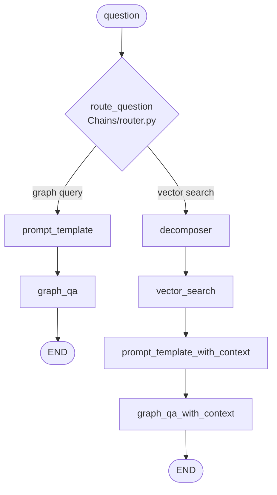
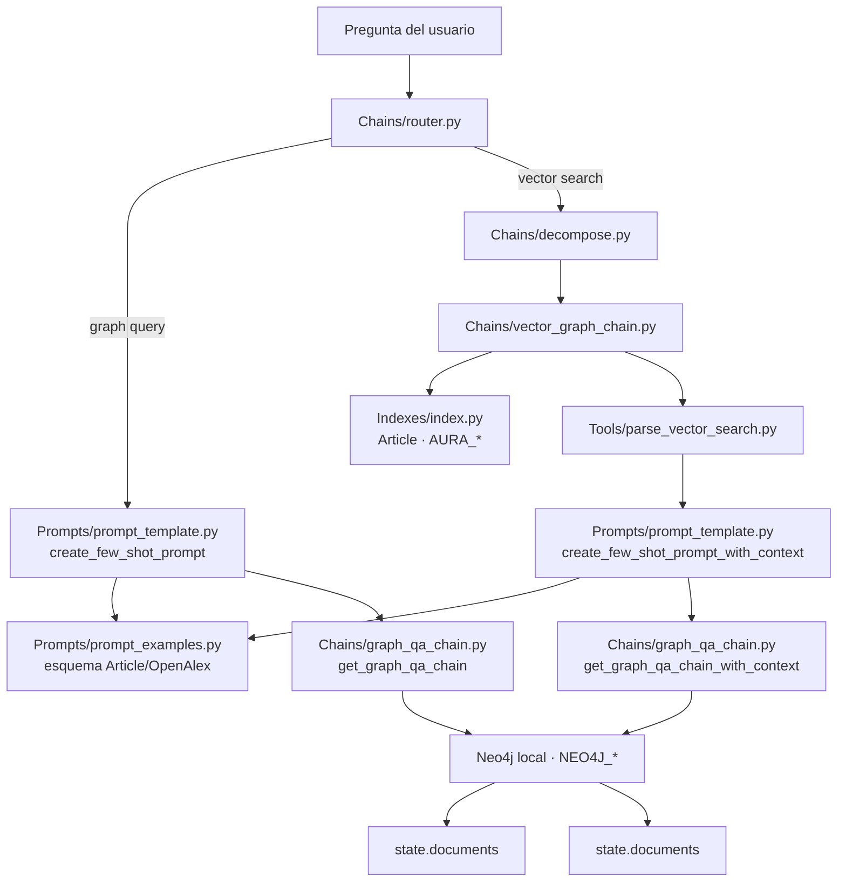

# Arquitectura y workflow de Pipeline_RAG — de principio a fin

Este documento explica, paso a paso, cómo está armado `Pipeline_RAG` hoy: qué hace cada archivo, en qué
orden se ejecutan, qué datos se pasan entre pasos, y qué inconsistencias existen actualmente en el código
(útiles de tener presentes antes de seguir extendiendo el sistema). Es un documento de análisis —
no modifica ningún archivo de código.

## 1. Qué es este pipeline, en una frase

Es un flujo de pregunta-respuesta (QA) construido con **LangGraph**: recibe una pregunta en lenguaje
natural, un LLM decide cómo resolverla (traduciéndola directo a Cypher, o primero buscando nodos
similares por embeddings y usando esos resultados como contexto), ejecuta esa estrategia contra una base
de datos **Neo4j**, y devuelve el resultado.

## 2. Punto de entrada

`00_run_script.ipynb` es la forma en que hoy se ejecuta el pipeline:

```python
from Graph.graph import app
result = app.invoke({"question": "..."})
```

`app` es el grafo de LangGraph ya compilado (`Graph/graph.py:58`, `workflow.compile()`). Todo lo demás en
el repositorio existe para que ese `app.invoke(...)` funcione.

## 3. El "estado" que viaja por todo el flujo — `Graph/state.py`

`GraphState` es un `TypedDict` — una especie de ficha compartida que cada paso del grafo lee y le agrega
información. Campos declarados hoy:

| Campo | Para qué se usa |
|---|---|
| `question` | La pregunta original del usuario. |
| `documents` | El resultado final de la cadena de QA (Cypher o vector search) que responde la pregunta. |
| `nodes_ids` | **Declarado pero nunca usado.** Ver sección 8 (problemas conocidos). |
| `prompt` | El few-shot prompt armado para la rama de Cypher directo. |
| `prompt_with_context` | El few-shot prompt armado para la rama con contexto de vector search. |
| `subqueries` | Las sub-preguntas en que se descompone la pregunta original (rama de vector search). |

**Importante:** `Graph/nodes.py` y `Prompts/prompt_template.py` leen/escriben una clave `article_ids` que
**no está declarada** en este `TypedDict` — es un campo "fantasma" que funciona en tiempo de ejecución
(Python no valida `TypedDict` en runtime) pero no está documentado en la forma oficial del estado. Ver
sección 8.

## 4. El grafo compilado — `Graph/graph.py`

Arma un `StateGraph(GraphState)` con dos ramas posibles, elegidas dinámicamente por un enrutador:



Los nombres de nodo/edge están centralizados como constantes en `Graph/labels.py` (`DECOMPOSER`,
`VECTOR_SEARCH`, `GRAPH_QA`, `GRAPH_QA_WITH_CONTEXT`, `PROMPT_TEMPLATE`, `PROMPT_TEMPLATE_WITH_CONTEXT`) —
nótese que `Graph/labels.py` también define `RETRIEVE`, `GRADE_DOCUMENTS`, `GENERATE`, `CREATE_CONTEXT`,
`CREATE_PREFIX`, que **no se usan en ningún nodo actual** (restos de una versión anterior/planeada del
grafo, ej. un flujo tipo self-RAG con "grade documents").

Las funciones reales de cada nodo viven todas en `Graph/nodes.py` (import centralizado en `graph.py:10`).

## 5. Paso 1 — Enrutamiento: ¿Cypher directo o búsqueda vectorial primero?

**Archivo:** `Chains/router.py`, invocado desde `route_question()` en `Graph/graph.py:15-24`.

- Usa `AzureChatOpenAI` (deployment `AZURE_CHAT_DEPLOYMENT`) con salida estructurada
  (`with_structured_output(RouteQuery)`), donde `RouteQuery.datasource` es un `Literal["vector search", "graph query"]`.
- El *system prompt* (líneas 30-62) describe el grafo como el ecosistema de **Hugging Face Hub**
  (`Model, Dataset, Space, Author, Tag, Repository, Commits, Discussion, ModifiedFile`) y da ejemplos de
  cuándo usar cada ruta. **Ojo:** este texto ya menciona una tercera categoría conceptual ("Graph DB Query"
  para Cypher crudo pasado directo), pero el `Literal` de `RouteQuery` solo admite dos valores
  (`"vector search"` / `"graph query"`) — esa tercera categoría no tiene forma de expresarse en la salida
  real, es una inconsistencia entre el texto del prompt y el schema que sí se aplica.
- `route_question()` en `graph.py` solo mapea dos casos: `"vector search"` → nodo `decomposer`,
  `"graph query"` → nodo `prompt_template`.

## 6. Rama A — Graph QA directo (sin búsqueda vectorial)

`prompt_template` → `graph_qa` → `END`

### 6.1 `Graph/nodes.py::prompt_template` (líneas 66-76)
Llama a `Prompts/prompt_template.py::create_few_shot_prompt()`.

### 6.2 `Prompts/prompt_template.py::create_few_shot_prompt()` (líneas 28-51)
Arma un `FewShotPromptTemplate` de LangChain:
- Usa un `MaxMarginalRelevanceExampleSelector` (definido a nivel de módulo, líneas 14-19) que selecciona
  los `k=5` ejemplos más relevantes (por similitud + diversidad) de una lista fija de ejemplos
  (`Prompts/prompt_examples.py::examples`), embebidos con `OpenAIEmbeddings` y guardados en un
  vectorstore **Chroma** (en memoria/local, no Neo4j).
- El prefijo instruye al LLM a generar *solo* Cypher, sin explicaciones.

### 6.3 `Prompts/prompt_examples.py` — el esquema que "enseña" al LLM a generar Cypher
Es una lista de 28 pares `{question, query}` de ejemplo. **Este es un punto crítico:** todos los ejemplos
son sobre un esquema de **artículos académicos (estilo OpenAlex)** — labels `Article`, `Title`, `Author`,
`Institution`, `Journal`, `Year`, `Funder`, `Country`, relaciones `HAS_TITLE`, `WRITTEN_BY`,
`AFFILLIATED_TO` (con doble "L", así en todo el archivo), `PUBLISHED_IN`, `YEAR_PUBLISHED`, `FUNDED_BY`,
`IS_FROM`. **Ninguno** de los 28 ejemplos usa el esquema real de Hugging Face Hub (`Model`, `Dataset`,
`Space`, `Repository`, `Tag`) que sí describe `Chains/router.py`. Es decir: el enrutador ya "sabe" que el
grafo es de HF Hub, pero los ejemplos few-shot que enseñan a generar Cypher siguen siendo 100% del viejo
esquema de artículos.

### 6.4 `Graph/nodes.py::graph_qa` (líneas 79-94)
Llama a `Chains/graph_qa_chain.py::get_graph_qa_chain(state)`, que arma un `GraphCypherQAChain` de
`langchain_neo4j`:
- `cypher_llm` / `qa_llm`: `AzureChatOpenAI` (mismo deployment de chat que el router/decomposer).
- `graph`: una conexión `Neo4jGraph` propia de este archivo, apuntando al Neo4j **local**
  (`NEO4J_URI`/`NEO4J_USER`/`NEO4J_PASSWORD`/`NEO4J_DATABASE`) — el mismo Neo4j que puebla
  `Pipeline_embeddings` con el grafo de HF Hub.
- `validate_cypher=True`, `return_direct=True` (el resultado es el dato crudo de Neo4j, sin que un LLM lo
  "resuma" de nuevo), `allow_dangerous_requests=True` (requerido por la librería: reconoce que el Cypher
  generado por el LLM se ejecuta directo contra la base).
- Se invoca con `{"query": question}` y el resultado se guarda en `state["documents"]`.

**Consecuencia práctica de 6.3 + 6.4:** aunque esta rama corre contra el grafo real de HF Hub, el LLM está
entrenado con ejemplos de un esquema distinto (artículos), así que es probable que genere Cypher con
labels/relaciones que no existen en el grafo actual, salvo que la pregunta sea genérica. El propio
`00_run_script.ipynb` (última corrida guardada) muestra exactamente esto: para "find top 5 cited articles"
generó `MATCH (a:Article) WITH a ORDER BY a.citation_count DESC ...` — Cypher válido para el esquema de
artículos, pero esa corrida es de cuando el Neo4j real todavía tenía datos de OpenAlex, no de HF Hub.

## 7. Rama B — Búsqueda vectorial + Cypher con contexto

`decomposer` → `vector_search` → `prompt_template_with_context` → `graph_qa_with_context` → `END`

### 7.1 `Graph/nodes.py::decomposer` (líneas 35-42)
Llama a `Chains/decompose.py::query_analyzer`, que:
- Usa `AzureChatOpenAI` con `bind_tools([SubQuery])` para forzar la salida a seguir el molde `SubQuery`
  (un solo campo `sub_query: str`).
- El *system prompt* (líneas 51-62) le pide al modelo dividir la pregunta original en **exactamente dos**
  sub-preguntas: una para la búsqueda de similitud, otra para la consulta de grafo posterior.
- Devuelve una lista `subqueries` de objetos `SubQuery` (típicamente 2), guardada en `state["subqueries"]`.

### 7.2 `Graph/nodes.py::vector_search` (líneas 44-63)
- Toma **solo la primera** sub-pregunta (`queries[0].sub_query`) — la segunda (pensada para el Cypher
  posterior) no se usa aquí, se reserva para el paso 7.4.
- Llama a `Chains/vector_graph_chain.py::get_vector_graph_chain()`.
- **`Chains/vector_graph_chain.py`** arma un `RetrievalQA` (`chain_type="stuff"`, `k=3`,
  `return_source_documents=True`) usando:
  - `llm`: `ChatOpenAI(model="gpt-3.5-turbo")`, autenticado con `OPENAI_API_KEY` (variable **no presente**
    en el `.env` actual del repo — ver sección 8).
  - `retriever`: `Indexes/index.py::get_neo4j_vector_index()`, que crea un `Neo4jVector` sobre el label
    `Article` (`text_node_properties=['title','abstract']`, propiedad `embedding_vectors`), conectando con
    variables `AURA_CONNECTION_URI`/`AURA_USERNAME`/`AURA_PASSWORD` — **tampoco presentes** en el `.env`.
    Es decir: esta pieza apunta a un grafo/label/propiedad que no corresponde al grafo de HF Hub que
    `Pipeline_embeddings` sí pobló con embeddings reales (label por label, propiedad `embedding`, índices
    `vec_<label>_embedding`) — están completamente desconectadas hoy.
- El resultado (`chain_result['source_documents']`) se convierte a `DocumentModel` (`Tools/parse_vector_search.py`),
  cuya `Metadata` exige literalmente los campos `article_id` y `topics` — otro punto acoplado al esquema
  de artículos, no al de HF Hub.
- Se arman dos salidas: `documents` (lista de `{"title", "article_id"}`) y `article_ids` (lista de tuplas
  `("article_id", id)`), ambas guardadas en el estado — pese a que, como se vio en la sección 3, `article_ids`
  no está declarada en `GraphState`.

### 7.3 `Graph/nodes.py::prompt_template_with_context` (líneas 96-107)
Llama a `Prompts/prompt_template.py::create_few_shot_prompt_with_context(state)`, que:
- Lee `context = state["article_ids"]` (la lista de tuplas del paso anterior).
- Arma un prefijo de prompt que dice literalmente *"A context is provided from a vector search in a form
  of tuple ('a..', 'W..'). Use the second element of the tuple as a node id, e.g 'W....'"* — hardcodeando
  la convención de ids de OpenAlex (ids que empiezan con `W`), y usa el mismo `example_selector` /
  ejemplos de artículos de la sección 6.3 para el resto del few-shot.

### 7.4 `Graph/nodes.py::graph_qa_with_context` (líneas 111-128)
Llama a `Chains/graph_qa_chain.py::get_graph_qa_chain_with_context(state)` — igual que 6.4, pero con
`cypher_prompt=prompt_with_context` (el del paso 7.3) y `verbose=False`. Se invoca con
`{"query": queries[1].sub_query}` — aquí sí se usa la **segunda** sub-pregunta generada en 7.1.

## 8. Variables de entorno — quién lee qué, y qué falta

| Variable | Usada en | ¿Está en `.env`? |
|---|---|---|
| `NEO4J_URI`, `NEO4J_USER`, `NEO4J_PASSWORD`, `NEO4J_DATABASE` | `Graph/nodes.py`, `Chains/graph_qa_chain.py` (y todo `Pipeline_embeddings`) | Sí |
| `AZURE_OPENAI_ENDPOINT`, `AZURE_OPENAI_API_KEY`, `AZURE_OPENAI_API_VERSION`, `AZURE_CHAT_DEPLOYMENT` | `Chains/router.py`, `Chains/decompose.py`, `Chains/graph_qa_chain.py` | Sí |
| `AZURE_EMBEDDING_DEPLOYMENT` | Solo `Pipeline_embeddings` (no se usa hoy en `Pipeline_RAG`) | Sí |
| `AURA_CONNECTION_URI`, `AURA_USERNAME`, `AURA_PASSWORD` | `Indexes/index.py` (y `Tools/tools.py`, código muerto) | **No** |
| `OPENAI_API_KEY` | `Chains/vector_graph_chain.py` (LLM de respuesta), `Prompts/prompt_template.py` (embeddings del example selector) | **No** |

**Consecuencia:** la rama de "Graph QA directo" (sección 6) hoy puede ejecutarse de punta a punta con las
variables presentes, salvo por el desajuste de esquema (pregunta vs. ejemplos de artículos). La rama de
"búsqueda vectorial" (sección 7) tiene **dos dependencias sin configurar** (`AURA_*` y `OPENAI_API_KEY`) —
tal como está el `.env` hoy, instanciar `Indexes/index.py` o `Chains/vector_graph_chain.py` fallaría o se
conectaría con credenciales vacías/`None`.

## 9. Piezas que existen pero no participan del flujo (código muerto)

- **`Tools/tools.py`**: pensado para una futura versión basada en agentes (`@tool`-decorated functions),
  pero no se importa en ningún lado, y además no se puede ejecutar tal cual está (le faltan imports de
  `os` y de `tool`, y referencia variables/objetos — `AURA_CONNECTION_URI`, `vector_graph_chain`,
  `graph_qa_chain` — que no están definidos en ese módulo).
- **`Tools/parse_vector_search.py::create_context()`**: función huérfana, reemplazada por la lógica que
  ahora vive inline en `Graph/nodes.py::vector_search`; además está rota (usa una variable `queries` que
  nunca se define en esa función).
- **`Tools/parse_vector_search.py::ResultModel`**: definido pero no referenciado en ningún otro archivo.
- **`Graph/labels.py`**: las constantes `RETRIEVE`, `GRADE_DOCUMENTS`, `GENERATE`, `CREATE_CONTEXT`,
  `CREATE_PREFIX` no corresponden a ningún nodo real del grafo compilado hoy.
- **`Indexes/index.py`**: de sus 4 funciones (`get_neo4j_vector_index`, `get_neo4j_title_vector_index`,
  `get_neo4j_abstract_vector_index`, `get_neo4j_topic_vector_index`), solo la primera se usa; las otras 3
  son código muerto.
- **`README.md`**: describe el setup original (solo `OPENAI_API_KEY` + `AURA_*`, grafo poblado con
  metadata de OpenAlex vía la API pública de OpenAlex) — quedó desactualizado respecto al estado actual
  del repo (grafo de Hugging Face Hub en Neo4j local + Azure OpenAI), documentado en cambio en el
  `CLAUDE.md` de la raíz del proyecto.

## 10. Resumen visual — qué archivo interviene en cada paso



## 11. Puntos a tener presentes para trabajo futuro

1. El esquema de `Prompts/prompt_examples.py` (y el hardcoding de ids `article_id`/`W...` en
   `Tools/parse_vector_search.py` y `Prompts/prompt_template.py`) es lo primero que hay que actualizar
   para que el pipeline genere Cypher correcto contra el grafo real de HF Hub — independientemente de si
   se generaliza o no la búsqueda vectorial (ver `PLAN_busqueda_vectorial_multilabel.md`).
2. `Indexes/index.py` y `Chains/vector_graph_chain.py` deben migrar de `AURA_*`/`Article` al Neo4j local +
   los índices `vec_<label>_embedding` ya creados por `Pipeline_embeddings` (este es exactamente el
   alcance de `PLAN_busqueda_vectorial_multilabel.md`).
3. `OPENAI_API_KEY` no está configurada; si se sigue usando algo de OpenAI público en esta rama (LLM de
   respuesta, embeddings del example selector), hay que decidir si se agrega esa key o se migra también
   esa pieza a Azure, consistente con el resto del pipeline.
4. El campo de estado `article_ids` debería declararse explícitamente en `GraphState` (hoy funciona "por
   accidente", sin que `TypedDict` lo valide) y renombrarse una vez que deje de ser exclusivo de artículos.
