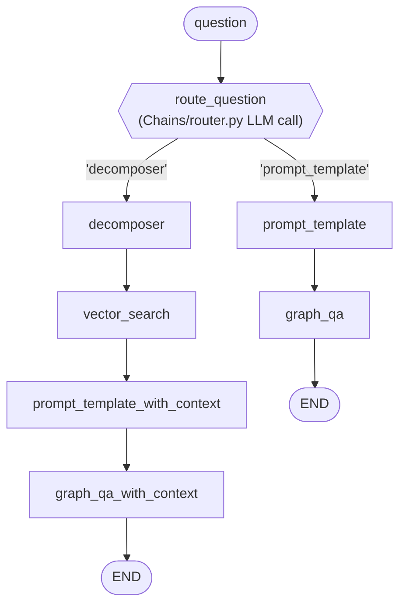

# `Graph/graph.py` explained, line by line

This file is the **assembly point** of the whole pipeline. `Graph/nodes.py` defines the individual
step functions (see `NODES_EXPLAINED.md`); `graph.py` is where those steps get wired together into an
actual flow — which node runs after which, and how the very first decision (which branch to take)
gets made. This is a companion doc to `ARQUITECTURA_Y_WORKFLOW.md` and `NODES_EXPLAINED.md`, zoomed
into this one file.

## What this file is, in one sentence

`graph.py` builds a **LangGraph `StateGraph`** — a small state machine where each node is a Python
function and each edge says "after this node finishes, run that node next" — and compiles it into
`app`, the object that `00_run_script.ipynb` calls with `app.invoke({"question": "..."})`.

## Full file, for reference

```python
from dotenv import load_dotenv
from langgraph.graph import END, StateGraph

from Chains.router import question_router
from Graph.state import GraphState
from Graph.labels import DECOMPOSER, VECTOR_SEARCH, GRAPH_QA, GRAPH_QA_WITH_CONTEXT, PROMPT_TEMPLATE, PROMPT_TEMPLATE_WITH_CONTEXT
from Graph.nodes import decomposer, vector_search, graph_qa, graph_qa_with_context, prompt_template, prompt_template_with_context

load_dotenv()

def route_question(state: GraphState):
    print("---ROUTE QUESTION---")
    question = state["question"]
    source = question_router.invoke({"question": question})
    if source.datasource == "vector search":
        print("---ROUTE QUESTION TO VECTOR SEARCH---")
        return "decomposer"
    elif source.datasource == "graph query":
        print("---ROUTE QUESTION TO GRAPH QA---")
        return "prompt_template"

workflow = StateGraph(GraphState)

workflow.add_node(PROMPT_TEMPLATE, prompt_template)
workflow.add_node(GRAPH_QA, graph_qa)

workflow.add_node(DECOMPOSER, decomposer)
workflow.add_node(VECTOR_SEARCH, vector_search)
workflow.add_node(PROMPT_TEMPLATE_WITH_CONTEXT, prompt_template_with_context)
workflow.add_node(GRAPH_QA_WITH_CONTEXT, graph_qa_with_context)

workflow.set_conditional_entry_point(
    route_question,
    {
        'decomposer': DECOMPOSER,
        'prompt_template': PROMPT_TEMPLATE
    },
)

workflow.add_edge(DECOMPOSER, VECTOR_SEARCH)
workflow.add_edge(VECTOR_SEARCH, PROMPT_TEMPLATE_WITH_CONTEXT)
workflow.add_edge(PROMPT_TEMPLATE_WITH_CONTEXT, GRAPH_QA_WITH_CONTEXT)
workflow.add_edge(GRAPH_QA_WITH_CONTEXT, END)

workflow.add_edge(PROMPT_TEMPLATE, GRAPH_QA)
workflow.add_edge(GRAPH_QA, END)

app = workflow.compile()
```

---

## Imports (lines 1–10)

```python
from dotenv import load_dotenv
from langgraph.graph import END, StateGraph
```
`load_dotenv` is a helper from the `python-dotenv` package: it reads the project's `.env` file (where
secrets like `NEO4J_PASSWORD` or `AZURE_OPENAI_API_KEY` live) and loads them as environment variables,
so any code that does `os.environ.get("...")` can find them. `StateGraph` and `END` come from
`langgraph` — `StateGraph` is the class used to build the whole workflow; `END` is a special marker
node meaning "the flow stops here."

```python
from Chains.router import question_router
from Graph.state import GraphState
from Graph.labels import DECOMPOSER, VECTOR_SEARCH, GRAPH_QA, GRAPH_QA_WITH_CONTEXT, PROMPT_TEMPLATE, PROMPT_TEMPLATE_WITH_CONTEXT
from Graph.nodes import decomposer, vector_search, graph_qa, graph_qa_with_context, prompt_template, prompt_template_with_context
```
Four things get imported from the project's own code:
- `question_router` — a ready-to-use LangChain chain from `Chains/router.py`. It's the piece that
  actually decides, using an LLM, whether a question should go through vector search or straight to
  Cypher generation.
- `GraphState` — the `TypedDict` describing the shared "state" that flows through every node (see
  `NODES_EXPLAINED.md` for its fields).
- A set of **name constants** from `Graph/labels.py` — e.g. `DECOMPOSER = "decomposer"`,
  `GRAPH_QA = "graph_qa"`. These are just plain strings, but by importing the constant instead of
  typing `"decomposer"` directly everywhere, a typo becomes an import error instead of a silent bug
  (e.g. `"decomposr"` would just fail differently — with a constant, it fails immediately as
  `ImportError`).
- The six node **functions** themselves, from `Graph/nodes.py` — the actual work each step does.

```python
load_dotenv()
```
Runs the `.env`-loading step described above, so the environment variables are available before any
of the imported chains (which read `os.environ.get(...)` at import time, e.g. inside
`Chains/graph_qa_chain.py`) try to use them.

---

## The router function — `route_question` (lines 15–24)

```python
def route_question(state: GraphState):
    print("---ROUTE QUESTION---")
    question = state["question"]
    source = question_router.invoke({"question": question})
    if source.datasource == "vector search":
        print("---ROUTE QUESTION TO VECTOR SEARCH---")
        return "decomposer"
    elif source.datasource == "graph query":
        print("---ROUTE QUESTION TO GRAPH QA---")
        return "prompt_template"
```

This function is the **entry-point decision** of the whole pipeline: given the state, which node
should run first?

- `question = state["question"]` — pulls out the user's original question.
- `source = question_router.invoke({"question": question})` — runs the router chain. Under the hood
  (see `Chains/router.py`), this sends the question to an Azure-hosted LLM along with a system prompt
  that describes the Hugging Face Hub graph schema (`Model`, `Dataset`, `Space`, `Author`, `Tag`,
  `Repository`, ...) and asks it to classify the question. The LLM's answer is forced into a
  structured `RouteQuery` object via `with_structured_output`, so `source.datasource` is guaranteed to
  be exactly the string `"vector search"` or `"graph query"` — never free-form text.
- The `if`/`elif` translates that classification into the **name of the next node to run**: the
  string `"decomposer"` or `"prompt_template"`. Note this function returns *plain strings*, not the
  node functions themselves — that's the contract LangGraph expects from a routing function (more on
  this below).
- The two `print(...)` calls are just console logging, so when you run the pipeline you can see in the
  terminal which branch got picked and why — useful for debugging, not part of the actual logic.

**Important nuance:** this function is *not* one of the graph's regular nodes — it never gets
registered with `workflow.add_node(...)`. It's a special kind of function LangGraph calls a
**conditional routing function**, used below in `set_conditional_entry_point`.

---

## Building the graph (line 27)

```python
workflow = StateGraph(GraphState)
```
Creates an empty workflow object, telling it upfront that every node in this graph will read from and
write to a dictionary shaped like `GraphState`. This is what lets LangGraph merge each node's returned
dictionary back into a single shared state as the flow progresses.

## Registering the nodes (lines 30–37)

```python
workflow.add_node(PROMPT_TEMPLATE, prompt_template)
workflow.add_node(GRAPH_QA, graph_qa)

workflow.add_node(DECOMPOSER, decomposer)
workflow.add_node(VECTOR_SEARCH, vector_search)
workflow.add_node(PROMPT_TEMPLATE_WITH_CONTEXT, prompt_template_with_context)
workflow.add_node(GRAPH_QA_WITH_CONTEXT, graph_qa_with_context)
```
Each call has the same shape: `add_node(name, function)` — it registers a Python function under a
string name, so it can be referenced by that name elsewhere in the graph (in edges, or in the routing
map below). All six node functions from `Graph/nodes.py` get registered here — two for the "direct
Cypher" branch (`prompt_template`, `graph_qa`), four for the "vector search" branch (`decomposer`,
`vector_search`, `prompt_template_with_context`, `graph_qa_with_context`).

The names being passed in (`PROMPT_TEMPLATE`, `GRAPH_QA`, etc.) are the constants imported from
`Graph/labels.py` — e.g. `PROMPT_TEMPLATE` is just the string `"prompt_template"`. Using the constant
instead of writing the string twice (here, and again wherever the node needs to be referenced) means
there's only one place to get the spelling right.

## Wiring the entry point — `set_conditional_entry_point` (lines 40–46)

```python
workflow.set_conditional_entry_point(
    route_question,
    {
        'decomposer': DECOMPOSER,
        'prompt_template': PROMPT_TEMPLATE
    },
)
```
This is the piece that actually connects the router to the rest of the graph, and it's worth slowing
down on. Normally a `StateGraph` needs one fixed starting node. `set_conditional_entry_point` instead
says: *"when the graph starts, don't jump straight to a node — call this function (`route_question`)
first, and use whatever string it returns to decide where to actually start."*

The dictionary argument is the **mapping** from `route_question`'s possible return values to the real
node names to jump to:
- `route_question` returns `"decomposer"` → the graph starts at the node registered as `DECOMPOSER`
  (i.e. the `decomposer` function).
- `route_question` returns `"prompt_template"` → the graph starts at the node registered as
  `PROMPT_TEMPLATE` (i.e. the `prompt_template` function).

In this particular case the dictionary's keys and values happen to be identical strings (both sides
say `"decomposer"` / `"prompt_template"`), which can make the mapping look redundant at first glance —
but the two sides mean different things: the **keys** are the literal strings `route_question` can
return (arbitrary, chosen by whoever wrote that function), while the **values** are node names that
must match something already passed to `add_node`. LangGraph needs this explicit table because, in
general, a routing function's return values don't have to match node names at all — they could be
`"yes"` / `"no"`, `"retry"`, anything.

## Wiring the rest of the edges (lines 49–56)

```python
workflow.add_edge(DECOMPOSER, VECTOR_SEARCH)
workflow.add_edge(VECTOR_SEARCH, PROMPT_TEMPLATE_WITH_CONTEXT)
workflow.add_edge(PROMPT_TEMPLATE_WITH_CONTEXT, GRAPH_QA_WITH_CONTEXT)
workflow.add_edge(GRAPH_QA_WITH_CONTEXT, END)

workflow.add_edge(PROMPT_TEMPLATE, GRAPH_QA)
workflow.add_edge(GRAPH_QA, END)
```
Unlike the entry point, these are **plain, unconditional edges**: `add_edge(A, B)` means "once node
`A` finishes, always run node `B` next — no decision involved." Together, these six lines describe
the two straight-line paths through the graph:

- **Vector search branch:** `decomposer → vector_search → prompt_template_with_context →
  graph_qa_with_context → END`
- **Direct Cypher branch:** `prompt_template → graph_qa → END`

`END` is the special LangGraph marker imported at the top of the file — an edge pointing to it means
"the graph is done; whatever is in `state` right now is the final result."

## Compiling the graph (line 58)

```python
app = workflow.compile()
```
Up to this point, `workflow` is just a *description* of the graph (nodes + edges) — it can still be
changed, and it can't be run yet. `.compile()` locks that description in and turns it into `app`, a
runnable object with an `.invoke(...)` method. This is the exact object imported in
`00_run_script.ipynb`:

```python
from Graph.graph import app
result = app.invoke({"question": "..."})
```

Calling `app.invoke({"question": "..."})` starts a fresh `state` containing just that one key, runs
`route_question` to decide the starting node, then keeps following edges — running each node function,
merging its returned dictionary into `state` — until it reaches `END`. Whatever `state` looks like at
that point is what `.invoke(...)` returns.

The last line of the file, `#app.get_graph().draw_mermaid_png(...)`, is commented out — it's a
LangGraph utility that can render the compiled graph as an image, left there for whoever's debugging
the graph's shape visually rather than reading the edges by hand.

---

## Putting it all together — the graph this file builds



Every box except `route_question` is a node registered with `workflow.add_node(...)`; every arrow
except the two coming out of `route_question` is a plain `workflow.add_edge(...)`; the two arrows out
of `route_question` are the conditional routing table passed to `set_conditional_entry_point`.
