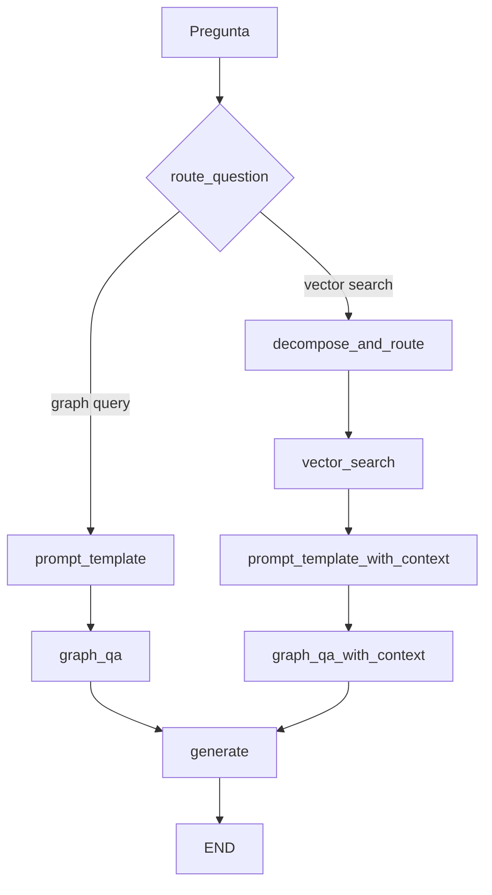
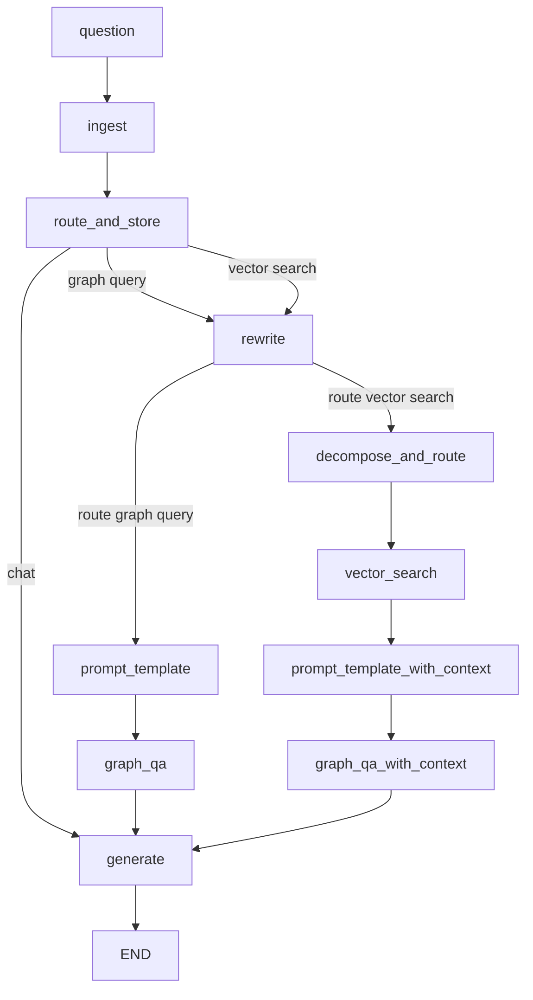

# Plan — Conversación con memoria de sesión sobre hallazgos GraphRAG

> Estado: **propuesta, no implementada**. Este documento describe el cambio; no se ha tocado código.
> Implementar cuando se retome: memoria de sesión + ruta `chat` + reescritura de follow-ups + loop en el notebook.

## Cómo responde hoy el pipeline

`00_run_script.ipynb` hace `app.invoke({"question": "..."})` y muestra `result["answer"]`. Eso ya es prosa (nodo `generate`), pero **cada invocación arranca de cero**.

No hay historial. El usuario no puede decir “explícame el primero” o “¿cuántos downloads tiene ese?” y esperar que el sistema recuerde los hallazgos del turno anterior.

Causas directas:

- [`Graph/state.py`](Graph/state.py) no tiene `messages` ni historial. Campos actuales: `question`, `documents`, `context_refs`, `prompt`, `prompt_with_context`, `subqueries`, `target_labels`, `answer`.
- [`Graph/graph.py`](Graph/graph.py) compila sin checkpointer: `app = workflow.compile()`. LangGraph no guarda estado entre invocaciones.
- [`Graph/nodes.py`](Graph/nodes.py) `generate` solo pasa `question` + `documents` a [`Chains/generate_answer.py`](Chains/generate_answer.py).
- [`Prompts/answer_promt.py`](Prompts/answer_promt.py) es un único turno `system` + `human` (el archivo se llama `answer_promt.py` a propósito: typo histórico; no renombrar).
- [`Chains/router.py`](Chains/router.py) solo conoce `"vector search"` | `"graph query"`. Un follow-up conversacional se trata como pregunta nueva y vuelve a Neo4j.

`langgraph>=1.0` ya está en el [`requirements.txt`](../requirements.txt) de la raíz. No hace falta paquete nuevo. `MemorySaver` / `add_messages` no se usan en ningún archivo hoy.

El flujo actual:



## Alcance de esta fase

Incluye:

- Memoria de todo lo hablado en la sesión (`thread_id` + checkpointer).
- Ruta `chat`: hablar de los hallazgos **sin** volver a Neo4j.
- Reescritura de follow-ups que **sí** piden datos nuevos del grafo (de “el primero” a un `model_id` concreto).
- Loop de sesión en [`00_run_script.ipynb`](00_run_script.ipynb).

No incluye:

- UI Streamlit / Gradio.
- Checkpointer persistente (SQLite / Postgres). `MemorySaver` in-process basta para el TG.
- Cambiar embeddings, índices Neo4j, o `return_direct=True`.

## Enfoque

Hay **dos tipos de turno**. Si no se distinguen, o se reconsulta el grafo en cada “explícalo” (caro y ruidoso) o nunca se piden datos nuevos.

| Tipo | Ejemplos | Qué debe pasar |
|---|---|---|
| Chat sobre hallazgos | “explícame el primero”, “compara 2 y 3”, “resúmelo en una tabla”, “pásalo a español” | **No** ir a Neo4j. Usar `documents` del checkpoint + historial. |
| Nueva consulta / más datos | “ahora los de Meta”, “¿cuántos downloads tiene el primero?”, “y sus datasets” | Reescribir el follow-up como pregunta autocontenida y sí pasar por vector/Cypher. |

Memoria: `MemorySaver` + `thread_id`. En invocaciones siguientes, las claves que **no** vienen en el input (sobre todo `documents`) persisten del checkpoint. Por eso la ruta `chat` puede ir directo a `generate` sin un campo extra `last_documents`, siempre que `generate` no pise `documents`.

Flujo objetivo:



Por qué un nodo `route_and_store` y no solo el condicional actual: `route_question` hoy es una función condicional y **no puede escribir** en el estado. Después de `rewrite` hay que ramificar otra vez (graph vs vector). Guardar `route` en el estado permite un solo LLM call de ruteo y reutilizarlo tras el rewrite.

## Qué no se toca

- `Pipeline_embeddings/`, índices Neo4j, `return_direct=True` en [`Chains/graph_qa_chain.py`](Chains/graph_qa_chain.py).
- [`Tools/tools.py`](Tools/tools.py) (código muerto; no es el camino).
- [`Prompts/prompt_examples.py`](Prompts/prompt_examples.py).
- Nombre del archivo `answer_promt.py` (typo histórico; no renombrar).
- No poner `temperature` en Azure (`gpt-5-mini` solo acepta el default).
- No UI Streamlit/Gradio.
- No arreglar de paso el bug de `decompose_and_route`: si el `except` corre, la línea siguiente usa `result.labels` y `result` no existe. Fuera de alcance.

Tampoco se reescribe [`ARQUITECTURA_Y_WORKFLOW.md`](ARQUITECTURA_Y_WORKFLOW.md) en esta fase; está desfasado respecto al código actual. Actualizarlo cuando el código de conversación esté estable, si se pide.

---

## Implementación paso a paso

Hacer los pasos **en orden**. Los pasos A–C son cimientos; D–E ya permiten conversar; F conecta follow-ups al grafo; G–J cierran notebook y verificación.

### Paso A — Constantes de nodos

Archivo: [`Graph/labels.py`](Graph/labels.py)

Añadir (junto a las constantes que ya existen: `GENERATE`, `DECOMPOSE_AND_ROUTE`, etc.):

```python
INGEST = "ingest"
ROUTE_AND_STORE = "route_and_store"
REWRITE = "rewrite"
```

`GENERATE` ya existe. No hace falta un nodo `CHAT`: esa ruta apunta al mismo `generate`.

### Paso B — Estado con historial

Archivo: [`Graph/state.py`](Graph/state.py)

Hoy `GraphState` es un `TypedDict` plano. Hay que añadir reducer en `messages` para que LangGraph **acumule** turnos en vez de reemplazar la lista.

Campos nuevos:

- `messages: Annotated[list, add_messages]` — historial de `HumanMessage` / `AIMessage`.
- `standalone_question: str` — pregunta reescrita, autocontenida, para Cypher/vector. En el primer turno = `question`.
- `route: str` — `"chat"` | `"graph query"` | `"vector search"`, guardado por `route_and_store`.

Imports:

```python
from typing import Annotated, List, TypedDict
from langgraph.graph.message import add_messages
```

No añadir `last_documents`. Con checkpointer, `documents` sobrevive entre turnos si ningún nodo lo pisa y el `invoke` no lo reenvía como `None`.

Actualizar el comentario-tabla que vive dentro de `state.py` para documentar las tres claves nuevas.

### Paso C — Helper de recorte (archivo nuevo)

Nuevo: [`Tools/session_memory.py`](Tools/session_memory.py)

Funciones pequeñas, **sin LLM**. Evitan mandar 20 turnos o dumps enormes de Cypher al router/rewrite.

```python
def recent_messages(messages, n=8):
    """Últimos N mensajes de la sesión."""
    ...

def messages_as_text(messages) -> str:
    """Serializa rol + contenido para prompts que no usan MessagesPlaceholder."""
    ...

def documents_digest(documents, max_chars=3000) -> str:
    """JSON compacto: ids, nombres, conteos. Sin tags largos ni listas enormes."""
    ...

def prior_messages_for_answer(messages, current_question: str):
    """Historial sin el HumanMessage del turno actual (evita duplicar {question})."""
    ...
```

Reglas:

- El prompt de `generate` sigue recibiendo `documents` **completo** (como hoy). El digest es solo para router y rewrite.
- `documents_digest` debe conservar ids (`model_id`, `repo_id`, etc.) porque el rewrite tiene que resolver “el primero” → un id literal.
- Si `documents` es `None` o `{}`, devolver `""`.

### Paso D — Nodo `ingest`

Archivo: [`Graph/nodes.py`](Graph/nodes.py)

Punto de entrada único. Append del turno del usuario **antes** de ruteo, para que el router del turno 2 vea el historial del turno 1 y el human actual.

```python
from langchain_core.messages import HumanMessage, AIMessage

@timed_node
def ingest(state: GraphState):
    print("---INGEST---")
    return {"messages": [HumanMessage(content=state["question"])]}
```

Con `add_messages`, devolver una lista de un elemento **concatena**; no borra el historial previo del checkpoint.

### Paso E — Router con tercera ruta `chat`

Archivo: [`Chains/router.py`](Chains/router.py)

Cambios:

1. Ampliar `RouteQuery.datasource` a `Literal["vector search", "graph query", "chat"]`.
2. El prompt humano deja de ser solo `{question}`. Variables: `{question}`, `{chat_history}`, `{documents_digest}`.
3. Ampliar el system prompt (conservar las reglas actuales de vector vs graph; añadir `chat`).

Reglas nuevas para el modelo:

- `chat` si hay hallazgos previos (`documents_digest` no vacío) y el usuario aclara, compara, resume, traduce o reformatea **sin pedir entidades, agregaciones o filtros nuevos**.
- Si pide un hecho que **no** está en el digest (likes, downloads, otro autor, otra entidad) → `graph query` o `vector search` como hasta ahora.
- Historial vacío o digest vacío → **nunca** `chat`.
- Pronombres (“eso”, “el primero”, “esos modelos”) no implican `chat` por sí solos: si piden un campo nuevo, es retrieval.

Ejemplos a meter en el prompt:

- Tras una lista de 5 modelos, “explícame el primero” → `chat`
- “compara el 2 y el 3” → `chat`
- “¿cuántos downloads tiene el primero?” → `graph query`
- “ahora modelos de meta” → `graph query` o `vector search` según semántica (no es aclaración; es entidad nueva)

Nodo nuevo `route_and_store` en [`Graph/nodes.py`](Graph/nodes.py) (un LLM call, escribe `route` en el estado):

```python
@timed_node
def route_and_store(state: GraphState):
    print("---ROUTE QUESTION---")
    source = question_router.invoke({
        "question": state["question"],
        "chat_history": messages_as_text(recent_messages(state.get("messages") or [])),
        "documents_digest": documents_digest(state.get("documents")),
    })
    route = source.datasource
    print(f"---ROUTE QUESTION TO {route.upper()}---")
    return {"route": route}
```

En [`Graph/graph.py`](Graph/graph.py), el condicional **después** de este nodo lee `state["route"]` (lambda o función mínima). Mapear:

- `"chat"` → `GENERATE`
- `"graph query"` → `REWRITE`
- `"vector search"` → `REWRITE`

### Paso F — Cadena y nodo `rewrite` (archivo nuevo)

Nuevo: [`Chains/rewrite.py`](Chains/rewrite.py)

Modelo: el mismo `AzureChatOpenAI` que el decomposer (`AZURE_DECOMPOSER_DEPLOYMENT`), **sin** `temperature++`. Salida: un string (o Pydantic de un campo `standalone_question`).

Tarea: historial + digest + follow-up → **una pregunta autocontenida** en el mismo idioma.

Ejemplos para el system prompt:

- “¿cuántos likes tiene el primero?” + digest con 5 `model_id` → pregunta que nombra el **primer** `model_id` literal del digest.
- Si la pregunta ya es autocontenida, devolverla igual.
- No inventar ids que no estén en el digest. Si no se puede resolver “el primero”, devolver la pregunta original (mejor un Cypher flojo que un id alucinado).

Nodo en [`Graph/nodes.py`](Graph/nodes.py):

```python
@timed_node
def rewrite(state: GraphState):
    question = state["question"]
    prior = [m for m in (state.get("messages") or []) if not (
        getattr(m, "type", None) == "human" and m.content == question
    )]
    if not prior:
        standalone = question
    else:
        standalone = rewrite_chain.invoke({
            "question": question,
            "chat_history": messages_as_text(recent_messages(state.get("messages") or [])),
            "documents_digest": documents_digest(state.get("documents")),
        })
    print(f"---REWRITE--- {standalone}")
    return {"standalone_question": standalone, "question": question}
```

Criterio de “primer turno”: si no hay mensajes previos (solo el Human actual), **no** llamar al LLM; `standalone_question = question`.

Los nodos de retrieval deben preferir `standalone_question`:

- `decompose_and_route`: `retriever_decompose_router.invoke({"question": state.get("standalone_question") or state["question"]})`
- `graph_qa`: el `query` del `invoke` de `GraphCypherQAChain` = standalone
- `vector_search` / `graph_qa_with_context`: las subqueries ya salen del decomposer sobre la pregunta reescrita; no hace falta volver a reescribir ahí

`question` original se conserva para `generate`: el usuario ve su wording, no el rewrite.

Tras `rewrite`, condicional sobre `state["route"]`:

- `"graph query"` → `PROMPT_TEMPLATE` → `GRAPH_QA` → `GENERATE`
- `"vector search"` → `DECOMPOSE_AND_ROUTE` → `VECTOR_SEARCH` → `PROMPT_TEMPLATE_WITH_CONTEXT` → `GRAPH_QA_WITH_CONTEXT` → `GENERATE`

### Paso G — Prompt y cadena de respuesta con historial

Archivo: [`Prompts/answer_promt.py`](Prompts/answer_promt.py)

Pasar de un único turno a un chat real, **sin relajar el grounding**:

```python
from langchain_core.prompts import ChatPromptTemplate, MessagesPlaceholder

answer_prompt = ChatPromptTemplate.from_messages([
    ("system", system),
    MessagesPlaceholder("messages", optional=True),
    ("human", Human_prompt),
])
```

El `MessagesPlaceholder` debe ser **historial previo**, no el turno actual. El bloque human ya tiene `{question}` + `{documents}`. Si se incluye también el último `HumanMessage`, el modelo ve la pregunta dos veces.

Añadir al system (al final de las reglas de grounding, no como sustituto):

- Hay historial de esta sesión; úsalo para resolver referencias (“el primero”, “esos”).
- Los hechos canónicos siguen siendo `documents` del último retrieval. El historial no autoriza a inventar nodos, conteos ni propiedades de Hugging Face.
- En un turno `chat`, si `documents` no cubre lo pedido, decirlo y no alucinar. Este nodo no reconsulta el grafo.

Archivo: [`Chains/generate_answer.py`](Chains/generate_answer.py)

El `invoke` debe incluir `"messages": inputs.get("messages") or []` además de `question` y `documents`.

Nodo `generate` en [`Graph/nodes.py`](Graph/nodes.py):

```python
@timed_node
def generate(state: GraphState):
    print("----GENERATE ANSWER----")
    prior_only = prior_messages_for_answer(
        state.get("messages") or [],
        state["question"],
    )
    answer = generate_answer({
        "question": state["question"],
        "documents": state.get("documents"),
        "messages": prior_only,
    })
    return {"answer": answer, "messages": [AIMessage(content=answer)]}
```

`add_messages` concatena el `AIMessage`. **No** devolver `documents` aquí (se conservan del checkpoint / del nodo de retrieval).

`generate_answer` ya serializa `documents` con `_to_text`; seguir usándola. No pasar el dict crudo al `ChatPromptTemplate`.

### Paso H — Recablear el grafo

Archivo: [`Graph/graph.py`](Graph/graph.py)

Hoy: `set_conditional_entry_point(route_question, ...)` y `workflow.compile()` sin checkpointer.

Reemplazar por:

1. Importar `INGEST`, `ROUTE_AND_STORE`, `REWRITE`, `ingest`, `route_and_store`, `rewrite`, `MemorySaver`.
2. Añadir los tres nodos nuevos.
3. `workflow.set_entry_point(INGEST)`.
4. `INGEST` → `ROUTE_AND_STORE`.
5. Condicional desde `ROUTE_AND_STORE` según `state["route"]`.
6. Condicional desde `REWRITE` según `state["route"]` (solo graph vs vector; `chat` nunca llega aquí).
7. Conservar los edges actuales de cada rama hacia `GENERATE` → `END`.
8. Compilar con memoria:

```python
from langgraph.checkpoint.memory import MemorySaver

app = workflow.compile(checkpointer=MemorySaver())
```

`MemorySaver` es in-process: reiniciar el kernel del notebook borra la sesión. Para el TG es suficiente.

Esqueleto de edges (usar las constantes de `labels.py`, no strings sueltos):

```python
workflow.add_edge(INGEST, ROUTE_AND_STORE)
workflow.add_conditional_edges(
    ROUTE_AND_STORE,
    lambda s: s["route"],
    {
        "chat": GENERATE,
        "graph query": REWRITE,
        "vector search": REWRITE,
    },
)
workflow.add_conditional_edges(
    REWRITE,
    lambda s: s["route"],
    {
        "graph query": PROMPT_TEMPLATE,
        "vector search": DECOMPOSE_AND_ROUTE,
    },
)
# edges de cada rama hacia GENERATE, y GENERATE → END: igual que hoy
```

La función actual `route_question` en `graph.py` deja de ser el entry condicional. Su lógica pasa a `route_and_store` en `nodes.py`. Se puede borrar `route_question` de `graph.py` para no tener dos routers.

### Paso I — Notebook: loop de sesión

Archivo: [`00_run_script.ipynb`](00_run_script.ipynb)

No borrar las celdas de invocación suelta; marcarlas como “turno único / sin `thread_id` estable”. Añadir un bloque de sesión:

```python
from IPython.display import Markdown, display

SESSION_ID = "tg-demo"
config = {"configurable": {"thread_id": SESSION_ID}}

def chat(text: str):
    out = app.invoke({"question": text}, config=config)
    display(Markdown(out["answer"]))
    return out
```

Regla crítica de `invoke`: pasar **solo** `{"question": text}`. Si se reenvía `documents: None` se pisa el checkpoint y el turno `chat` se queda sin hallazgos.

Script de prueba a dejar en celdas del notebook:

1. `chat("find top 5 models related to text classification")` — debe ir a vector search (logs actuales de esa rama).
2. `chat("explícame el primero y en qué se diferencia del segundo")` — logs: `ROUTE QUESTION TO CHAT`, **sin** `Entering new GraphCypherQAChain` ni `vector.queryNodes`.
3. `chat("¿cuántos downloads tiene el primero?")` — ruta `graph query`; el print `---REWRITE---` debe contener un `model_id` real del paso 1, no el literal “el primero”.
4. Nuevo `thread_id` (por ejemplo `"tg-demo-fresh"`) y `chat("explícame el primero")` — **no** debe ir a `chat` (historial/digest vacíos).

Dejar un comentario en la celda: re-importar `from Graph.graph import app` crea un `MemorySaver` vacío. Un kernel = un `app`. Cambiar de sesión = cambiar `thread_id`, no recompilar.

### Paso J — Verificación (no hay test suite)

Validar a mano contra Neo4j + Azure, en este orden:

1. Turno 1 idéntico al comportamiento actual (misma rama, `answer` grounded en `documents`).
2. Turno 2 chat: no aparece `Entering new GraphCypherQAChain` ni `db.index.vector.queryNodes`.
3. Turno 3 rewrite + graph: el Cypher generado contiene un id real del turno 1, no el literal “el primero”.
4. Tras un turno chat, `out["documents"]` sigue siendo el del último retrieval (no vacío / no pisado).
5. Otro `thread_id` no filtra memoria de la sesión anterior.
6. Pregunta en español → respuesta en español (regla ya existente en `answer_promt.py`).
7. Primer turno de una sesión nueva que sea “explícame eso” → no `chat` (digest vacío); el generate o el graph QA deben fallar de forma honesta, no inventar.

---

## Orden de implementación recomendado (cuando se codee)

1. `session_memory.py` + campos de estado + `ingest` + checkpointer (aún sin ruta chat: el historial ya se guarda).
2. Prompt/cadena `generate` con `MessagesPlaceholder` + nodo que escribe `AIMessage`.
3. Router `chat` + `route_and_store` + recableado (ya se puede conversar sobre hallazgos).
4. `rewrite.py` + `standalone_question` en nodos de retrieval.
5. Helper `chat()` y celdas de prueba en el notebook.
6. Pasar el script de verificación del Paso J.

Los pasos 1–3 ya cumplen “hablar de la respuesta con memoria”. El 4 conecta follow-ups al grafo.

## Tareas de implementación

- [ ] Añadir `INGEST`, `ROUTE_AND_STORE`, `REWRITE` en `Graph/labels.py`
- [ ] Añadir `messages`, `standalone_question`, `route` a `GraphState`
- [ ] Crear `Tools/session_memory.py` (`recent_messages`, `messages_as_text`, `documents_digest`, `prior_messages_for_answer`)
- [ ] Nodo `ingest` en `nodes.py`
- [ ] Tercera ruta `chat` en `Chains/router.py` (historial + digest)
- [ ] Nodo `route_and_store` que guarda `route` en el estado
- [ ] Crear `Chains/rewrite.py` y nodo `rewrite`; usarlo en `graph_qa` / `decompose_and_route`
- [ ] `MessagesPlaceholder` en `answer_promt.py`; pasar `messages` en `generate_answer` y `generate`
- [ ] Recablear `graph.py`: entry `ingest` → `route_and_store` → chat|rewrite; `compile(checkpointer=MemorySaver())`
- [ ] Helper `chat()` + celdas de prueba en `00_run_script.ipynb`
- [ ] Verificar a mano el script del Paso J contra Neo4j + Azure

## Cuidados

- **Tokens:** historial recortado a 8 mensajes; digest ≤3000 chars en router/rewrite; `documents` completo solo en `generate`.
- **Grounding:** el historial puede hacer que el modelo “recuerde mal”. `documents` manda. El system prompt de respuesta no se relaja.
- **Checkpointer y Jupyter:** un `MemorySaver` por proceso. Re-importar `graph.py` crea otro saver vacío. Dejar `app` importado una vez por kernel; cambiar de sesión = cambiar `thread_id`, no recompilar.
- **Input de `invoke`:** pasar solo `{"question": text}`. Si se reenvía `documents: None` se pisa el checkpoint.
- **Duplicar la pregunta** en `messages` + human template: usar `prior_messages_for_answer` en `generate`.
- **Ids alucinados en rewrite:** el prompt debe prohibir inventar ids fuera del digest; fallback = pregunta original.

## Archivos resultantes

Nuevos (al implementar código):

- `Pipeline_RAG/Tools/session_memory.py`
- `Pipeline_RAG/Chains/rewrite.py`

Este documento (ya creado):

- `Pipeline_RAG/PLAN_conversacion_memoria.md`

Modificados al implementar código:

- `Pipeline_RAG/Graph/state.py`
- `Pipeline_RAG/Graph/labels.py`
- `Pipeline_RAG/Graph/graph.py`
- `Pipeline_RAG/Graph/nodes.py`
- `Pipeline_RAG/Chains/router.py`
- `Pipeline_RAG/Chains/generate_answer.py`
- `Pipeline_RAG/Prompts/answer_promt.py`
- `Pipeline_RAG/00_run_script.ipynb`
