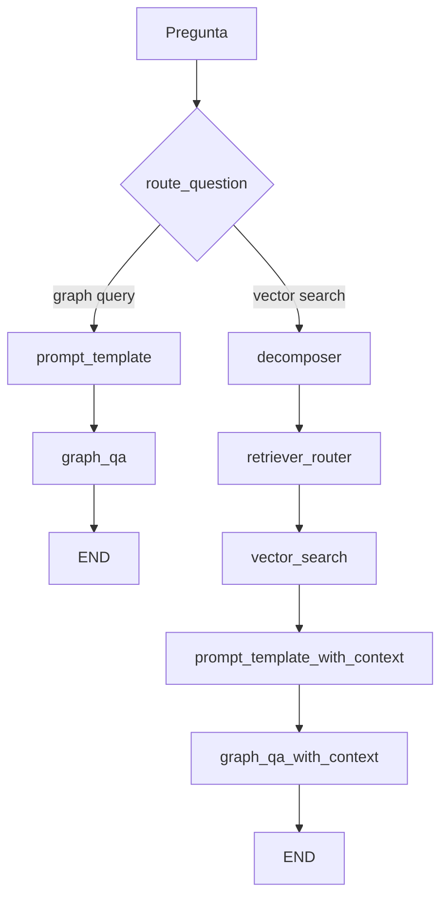
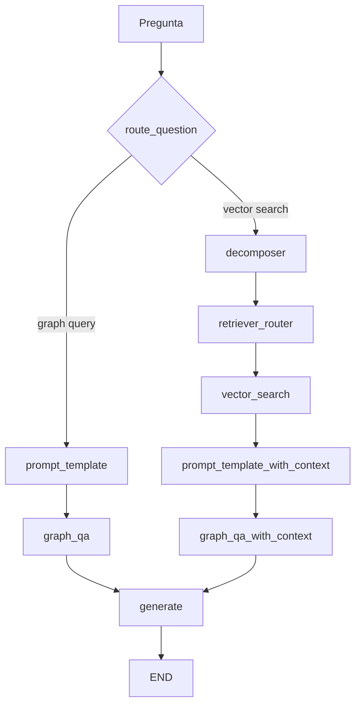

# Plan — Respuesta explicativa con LLM sobre el resultado actual

> Estado: **propuesta, no implementada**. Este documento describe el cambio; no se ha tocado código.
> Implementar cuando se retome: añadir un nodo final de síntesis en LangGraph.

## Cómo responde hoy el pipeline

`00_run_script.ipynb` solo hace `app.invoke({"question": "..."})` y lee `result["documents"]`. Ese campo **no es una respuesta en prosa**: es el JSON crudo de Neo4j.

Causa directa en [`Pipeline_RAG/Chains/graph_qa_chain.py`](Chains/graph_qa_chain.py): ambas cadenas (`get_graph_qa_chain` y `get_graph_qa_chain_with_context`) tienen `return_direct=True`. El `qa_llm` ya está instanciado pero **nunca se usa**. El flujo termina así:



Ejemplos reales del notebook:

- `"How many models are there in total?"` → `{'result': [{'count(m)': 708377}]}`
- `"What models were created by ... GOOGLE?"` → lista de `m.model_id` sin explicación
- `"find top 5 models related to text classification"` → ids con `name`/`description` en `None`

El LLM ya interviene **antes** (router, decomposer, generación de Cypher). Falta un paso **después** que redacte la respuesta.

**No** basta con poner `return_direct=False`. Eso usaría el prompt QA genérico de LangChain, mezclaría el formato de salida y perdería control. El pedido es: **conservar la salida actual como contexto** y elaborar encima.

## Enfoque

Añadir un nodo `generate` (la constante `GENERATE` ya existe en [`Pipeline_RAG/Graph/labels.py`](Graph/labels.py) y hoy no está cableada). Ambas ramas convergen ahí antes de `END`.



El nodo recibe `question` + `documents` (y, si existen, `subqueries` / `context_refs`) y escribe un campo nuevo `answer` en el estado. `documents` se deja intacto para depuración y para el notebook.

## Cambios concretos

1. **Estado** — [`Pipeline_RAG/Graph/state.py`](Graph/state.py): agregar `answer: str`.

2. **Prompt de síntesis** — nuevo archivo [`Pipeline_RAG/Prompts/answer_prompt.py`](Prompts/answer_prompt.py):
   - System: responder solo con lo que hay en el contexto; no inventar nodos, conteos ni relaciones; si el contexto está vacío o es incompleto, decirlo; responder en el idioma de la pregunta; ser explicativo (qué se encontró, cómo se interpreta, límites: `LIMIT`, campos `None`, scores).
   - Human: `question`, `documents` serializado (JSON), y opcionalmente `context_refs` / `subqueries`.

3. **Cadena** — nuevo [`Pipeline_RAG/Chains/generate_answer.py`](Chains/generate_answer.py):
   - Reutilizar el mismo `AzureChatOpenAI` que ya usan [`graph_qa_chain.py`](Chains/graph_qa_chain.py) y [`nodes.py`](Graph/nodes.py) (`AZURE_CHAT_DEPLOYMENT`, sin `temperature` explícita por `gpt-5-mini`).
   - `prompt | llm` → string.

4. **Nodo** — [`Pipeline_RAG/Graph/nodes.py`](Graph/nodes.py):

```python
def generate(state: GraphState):
    answer = generate_answer_chain.invoke({
        "question": state["question"],
        "documents": state.get("documents"),
        "context_refs": state.get("context_refs"),
        "subqueries": state.get("subqueries"),
    })
    return {"answer": answer}
```

5. **Grafo** — [`Pipeline_RAG/Graph/graph.py`](Graph/graph.py):
   - `workflow.add_node(GENERATE, generate)`
   - Cambiar `GRAPH_QA → END` y `GRAPH_QA_WITH_CONTEXT → END` por ambas → `GENERATE` → `END`.

6. **Notebook** — [`Pipeline_RAG/00_run_script.ipynb`](00_run_script.ipynb): en las celdas de inspección, mostrar `result["answer"]` además de `result["documents"]`, para comparar dato crudo vs. prosa.

## Tareas de implementación

- [ ] Agregar campo `answer: str` a `GraphState`
- [ ] Crear `Prompts/answer_prompt.py` y `Chains/generate_answer.py` con AzureChatOpenAI
- [ ] Nodo `generate` en `nodes.py` y cablearlo en `graph.py` (ambas ramas → GENERATE → END)
- [ ] Actualizar `00_run_script.ipynb` para mostrar `answer` además de `documents`

## Qué no se toca

- Router, decomposer, retriever_router, vector search, few-shot Cypher, `return_direct=True`.
- El contrato de `documents` (sigue siendo el JSON de Neo4j).
- No se reescribe [`ARQUITECTURA_Y_WORKFLOW.md`](ARQUITECTURA_Y_WORKFLOW.md) salvo que se pida: ese doc ya está desfasado respecto al código actual (`retriever_router`, `context_refs`, índices HF Hub).

## Cómo verificar

Re-ejecutar en el notebook las tres preguntas ya corridas y comprobar que `answer` explica el dato sin inventar:

- Conteo: debe mencionar ~708377 modelos, no un número distinto.
- Autor Google: debe listar/resumir los `model_id` devueltos y aclarar que es un recorte (`LIMIT` implícito del Cypher).
- Vector search: debe explicar los hits y que `name`/`description` vienen vacíos en el grafo, no inventar descripciones.

Si el contexto es una lista larga, el prompt pedirá resumir con ejemplos representativos en vez de pegar cientos de ids.
